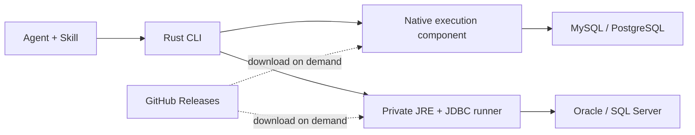

# SQL CLI first-release design

Updated: 2026-09-10
Status: first release in progress; the sections below state design goals, while actual support and verification status live in README.

## 1. Goals

Design a new standalone CLI whose business core is user-level datasource management, database connections and SQL execution. A companion Skill explains how to use the CLI and provides recipes for common operations on each database, so an agent can choose SQL and execute it directly through the CLI.

Initialization, credential encryption and driver downloads are the foundation modules behind those capabilities. The first release aims at a minimal but complete implementation.

Device identity has to correlate with the same machine, providing the basis for later automatic updates, device information reporting and daily-active statistics; the first release settles the identity model first, and networked updates plus activity reporting come later.

This document records the settled product scope and the proposed implementation approach separately. `sqlx` is used as the example command name and `~/.sqlx/` as the user directory under discussion. Per the latest discussion, native database connections and the Rust/JDBC bridge reuse the Chat2DB-Rust implementations first, adapted to this CLI's execution and delivery boundaries.

## 2. First-release scope and current distribution proposal

Except for the download source, which the latest discussion adjusted to the proposal below, the rest of the product scope follows the decisions already confirmed.

| Item | Decision or proposal |
|---|---|
| Main program | Rust, delivered as a standalone executable per platform |
| Driver strategy | Rust native drivers plus JDBC as a supplement |
| Driver installation | Not installed with the main program; downloaded on demand into the user data directory on first use |
| Native component form | The database driver library together with the connection and SQL execution code is compiled into a standalone executable component that the main CLI downloads and invokes |
| Code source | Native connections and the Rust/JDBC bridge draw first on the relevant Chat2DB-Rust implementations |
| JDBC dependencies | The JRE, the JDBC runner, driver JARs and required dependencies are all downloaded on demand |
| Download source | The proposal is public GitHub Releases for the first release; the product team still maintains driver versions, default choices and update targets |
| First-release databases | MySQL, Oracle, SQL Server, PostgreSQL |
| Datasource scope | User-level storage with the username and password saved encrypted |
| Initialization | Generate a local independent encryption key, a machine-linked device identity and an installation instance identity |
| Device identity purpose | Provide the correlation key for later automatic updates, device information reporting and daily-active-device statistics |
| SQL input | Several SQL statements in one call; file input is not supported in the first release |
| SQL options | Parameters for transaction mode and failure strategy are deferred to a later extension |
| Sessions | No cross-call session in the first release |
| Output | Complete structured results; the CLI never truncates on its own |
| Large-result optimization | A later version can return partial results and write the full result to a file |
| Companion Skill | CLI usage plus recipes for database operations such as inspecting database, schema and DDL |
| Skill distribution | Proposal: publish as a standalone documentation package to GitHub Releases, download on demand and install into the chosen agent's skill directory |
| Installation entry points | The CLI can install the Skill directly, and the Skill can be installed first and then guide the agent through installing the CLI |
| Current delivery | Design document only |

### 2.1 First-release capabilities and commands at a glance

The table below lists the capabilities planned for the first release and the proposed command contracts; none is implemented yet. Commands use `sqlx` as the example, `<id>` is a stable datasource ID and `...` stands for the connection parameters of a given database type; the exact input form for the username and password is still to be settled as described in section 5.

| Capability | First-release support | Command or trigger |
|---|---|---|
| Initialization | Create the user directory, an independent encryption key, the device ID and the installation instance ID; repeated initialization keeps valid state | `sqlx init`; an automatic initialization also runs the first time local state is needed |
| Add a datasource | Save connection settings for MySQL, MariaDB, PostgreSQL, CockroachDB, Oracle, SQL Server, ClickHouse and Trino | `sqlx datasource add ...` |
| List datasources | Return the current user's datasource list with sensitive information hidden | `sqlx datasource list` |
| Show a datasource | Show one datasource's non-sensitive settings | `sqlx datasource show --id <id>` |
| Update a datasource | Change connection settings or credentials while keeping the datasource ID | `sqlx datasource update --id <id> ...` |
| Remove a datasource | Delete the specified saved connection of the current user without deleting database contents | `sqlx datasource remove --id <id>` |
| Test a connection | Open a temporary connection, return a structured check result and then close it | `sqlx datasource test --id <id>` |
| Execute one SQL statement | Queries, DML, DDL and any other SQL the driver can execute | `sqlx sql execute --datasource <id> --command "SQL"` |
| Execute multiple SQL statements | Execute in order on the same connection, autocommit by default and stop on error, returning results statement by statement | `sqlx sql execute --datasource <id> --command "SQL 1" --command "SQL 2"` |
| Inspect database structure | Use the Skill recipes to query database, schema, tables, columns, indexes, constraints and DDL | Always `sqlx sql execute`; no dedicated metadata command is added |
| Complete structured output | Return all query data, column types, update counts and execution errors without truncating on its own | SQL execution commands output structured JSON by default, with no extra switch |
| Credential encryption | The username and password are saved encrypted with the user-level datasource settings and hidden on read | Handled automatically by datasource commands; no separate encrypt/decrypt command |
| Driver and runtime preparation | Download the native execution component, or the JDBC runner, drivers and private JRE, from the manifest; reuse the local cache | Triggered automatically by a connection test or SQL execution; no manual Java installation or driver version choice |
| Install the Skill into an agent | Download the compatible Skill version and database documentation, and install them into the chosen agent's skill directory | `sqlx skill install --target <agent-name>` |
| Install the Skill into a given directory | Download and install the complete Skill package, keeping the referenced documentation directory | `sqlx skill install --path <target-skill-dir>` |
| Update the Skill | Update a CLI-managed Skill to a compatible version | `sqlx skill update` |
| Show Skill status | Show the installed version and the installation target | `sqlx skill status` |
| The Skill guides a CLI install | The agent checks the CLI and, when it is missing, downloads, verifies, installs and initializes it as the Skill describes | `references/cli.md` in the Skill; nothing depends on a `sqlx` command before the install |
| Help | Show command and argument documentation | `sqlx --help`, `sqlx <subcommand> --help` |
| Version | Show the main program version so users and the Skill can judge compatibility | `sqlx --version` |

Datasource and SQL responses are structured; help text stays human-readable. The release manifest controls the exact driver and runtime versions, and the first release adds no driver command that makes users manage versions themselves.

The first release excludes SQL file input, cross-call sessions, parameters for transaction mode and failure strategy, result pagination or writing the full result to a file, automatic main-program updates, and device information reporting and daily-active statistics services. Device identity is generated locally first and the related networked features come later; explicit Skill installation and update are part of the first release.

### 2.2 First platforms

| Operating system | CPU architecture |
|---|---|
| macOS | ARM64, x64 |
| Windows | x64 |
| Linux | ARM64, x64 |

Native components and the JRE are published per operating system and CPU architecture. A pure-Java JDBC driver can usually reuse the same JAR; drivers that contain native libraries still need platform compatibility verification. The minimum operating system version and the Linux runtime baseline are settled during the release phase.

## 3. Execution architecture

### 3.1 Proposed driver split for the first release

| Database | Proposed backend | Notes |
|---|---|---|
| MySQL | Rust native execution component | Extract the `mysql_async` connection and execution logic from Chat2DB-Rust first and publish it with the component build |
| PostgreSQL | Rust native execution component | Extract the `tokio-postgres` connection and execution logic from Chat2DB-Rust first and publish it with the component build |
| Oracle | Official JDBC Thin driver | Runs in the private Java runtime, with no separate Oracle client installation |
| SQL Server | Official Microsoft JDBC driver | Reuse the official driver and the shared JDBC runner |

The last two are designed for username and password connections first; whether connection methods such as integrated authentication bring extra local dependencies needs separate verification and cannot inherit the delivery conclusions of a pure-Java connection method directly.



### 3.2 Responsibilities of the main program and the execution components

The Rust main program handles command parsing, initialization, encrypted datasource storage, component preparation and unified result output. A database execution component opens connections, executes SQL, reads results and closes connections.

Native drivers are settled as standalone executable components, proposed to communicate with the main CLI over standard input and output. The product team precompiles the database driver library together with the connection and SQL execution code into the driver component, which is then distributed per platform. The main program package includes no database drivers: users download the compiled components on first use and need neither Rust nor a local build.

The JDBC route uses a shared Java runner, choosing the driver JAR and a compatible private JRE per datasource. The CLI manages the Java runtime, so users never install Java manually. Users who only use native databases download no Java.

Both routes follow the same versioned execution protocol and expose the same CLI entry point and result structure to the agent. One invocation starts the relevant execution component, finishes this call's work on one connection and exits; the first release introduces no resident session service.

A datasource is explicitly bound to an execution backend. After a failed execution, the CLI does not silently switch to another driver and replay the SQL.

### 3.3 Scope of Chat2DB-Rust code reuse

This section is based on `Chat2DB-Rust/main` pulled and inspected on 2026-09-10, with source baseline `e17ee8be373407e193e7e12da0dcd3b5b4b5550b`. This round only reviews source and updates the plan; the new CLI has not been copied, built or verified yet.

The implementation strategy is to extract the existing connection, execution, type conversion and process-bridge code first, then replace it with the new CLI's configuration, protocol and output structures. Concrete Rust dependencies keep the libraries the corresponding implementation already uses; there is no need to rewrite them as SQLx just to unify the library name.

| Reused content | Source entry point | Adaptation |
|---|---|---|
| MySQL connection and execution | [native_mysql.rs](https://github.com/OtterMind/Chat2DB-Rust/blob/e17ee8be373407e193e7e12da0dcd3b5b4b5550b/crates/chat2db-core/src/native_mysql.rs): `connection_opts`, `open_connection_with_opts`, `execute_console_statement`, `mysql_value` | Extract `mysql_async` parameter construction, connection, per-result reading and type conversion, and replace the product request and result types |
| PostgreSQL connection and execution | [native_postgres.rs](https://github.com/OtterMind/Chat2DB-Rust/blob/e17ee8be373407e193e7e12da0dcd3b5b4b5550b/crates/chat2db-core/src/native_postgres.rs): `connection_config`, `open_prepared_connection`, `execute_console`, `decode_postgres_value` | Extract `tokio-postgres` connection, TLS, row reading and type conversion, holding the connection for this invocation |
| Rust launching and managing Java | [supervisor/mod.rs](https://github.com/OtterMind/Chat2DB-Rust/blob/e17ee8be373407e193e7e12da0dcd3b5b4b5550b/crates/chat2db-java-bridge/src/supervisor/mod.rs): `EngineConfig`, `spawn_process`, `EngineSupervisor` | Reuse process launch, standard input and output, handshake and process-exit handling, simplified to the lifecycle of a single CLI invocation |
| Rust JDBC requests and responses | [supervisor/jdbc.rs](https://github.com/OtterMind/Chat2DB-Rust/blob/e17ee8be373407e193e7e12da0dcd3b5b4b5550b/crates/chat2db-java-bridge/src/supervisor/jdbc.rs) and [chat2db-engine-protocol](https://github.com/OtterMind/Chat2DB-Rust/blob/e17ee8be373407e193e7e12da0dcd3b5b4b5550b/crates/chat2db-engine-protocol/) | Extract driver loading, connection sessions, query/update and result-batch communication; the protocol types it needs migrate with the component |
| Java external JAR loading | [DriverRegistry.java](https://github.com/OtterMind/Chat2DB-Rust/blob/e17ee8be373407e193e7e12da0dcd3b5b4b5550b/java/compat-runtime/src/main/java/ai/chat2db/rust/compat/DriverRegistry.java) | Reuse JAR verification, `URLClassLoader` loading and `Driver.connect`, with driver paths pointing at this CLI's download directory |
| Java sessions and SQL execution | [JdbcRuntime.java](https://github.com/OtterMind/Chat2DB-Rust/blob/e17ee8be373407e193e7e12da0dcd3b5b4b5550b/java/compat-runtime/src/main/java/ai/chat2db/rust/compat/JdbcRuntime.java) and [JdbcSession.java](https://github.com/OtterMind/Chat2DB-Rust/blob/e17ee8be373407e193e7e12da0dcd3b5b4b5550b/java/compat-runtime/src/main/java/ai/chat2db/rust/compat/JdbcSession.java) | Reuse the connection and execution foundation and add mixed query/update, multiple result sets and per-item batch output for the new entry point |

`chat2db-core` cannot be adopted wholesale: the existing native files depend on `Application`, `Storage`, product sessions, result retention and a large amount of metadata capability. The new CLI extracts the functions, types and corresponding test cases that connection and execution need, removes those product dependencies and then builds a standalone driver component.

Copying requires adapting each of the following confirmed differences:

1. **Complete output.** The existing native and JDBC queries include pagination, row count, cumulative result byte or single-value size limits, which cannot be inherited directly as the new CLI's truncation rules. Keep the bounded batch transfer and backpressure but change them to emit the whole result continuously; a single large field needs complete encoding or chunking, never omitted content.
2. **Unified multi-SQL entry point.** The existing JDBC `executeQuery` and `executeUpdate` are separate and the query implementation uses `PreparedStatement.executeQuery()`; the migration has to support mixed statements and multiple result sets at the new entry point, not merely loop the SQL array through the query interface.
3. **Connection lifecycle.** One batch in the new CLI opens exactly one connection and closes it when the batch ends. After extracting the low-level connection code, organize calls around that boundary and do not call product entry points that reconnect on their own statement by statement.
4. **Component distribution.** Split the existing library-level calls into a native execution program and a JDBC runner that can be downloaded on demand, wired into the GitHub Releases manifest and the user directory. Reusing source does not mean packaging and updating the standalone components is already done.
5. **Configuration and protocol mapping.** Replace the product-level request, error and data types; check TLS, default execution behavior and type encoding item by item so they match this CLI's conventions.

The Oracle and SQL Server JDBC routes use the shared bridge above to load their respective official drivers. Reusing the shared bridge does not mean the new components for these two databases are already adapted; they still need verification against the first release's connection, execution and complete-output requirements.

## 4. User data directory and initialization

### 4.1 Proposed layout

```text
~/.sqlx/
├── identity.json
├── master.key
├── datasources.enc
├── skills/
│   └── sqlx/<version>/
│       ├── SKILL.md
│       └── references/
├── runtimes/
│   └── java/<version>/<platform-arch>/
├── engines/
│   └── jdbc/<version>/runner.jar
└── drivers/
    ├── mysql/<version>/<platform-arch>/
    ├── postgresql/<version>/<platform-arch>/
    ├── oracle/<version>/
    └── sqlserver/<version>/
```

The directory belongs to the current operating system user; on Windows it is `.sqlx` under the current user directory. A normal upgrade of the main program and drivers on the same device does not rebuild the identity, clear datasources or replace the encryption master key.

### 4.2 Initialization process

The proposal is an explicit `init` command that also runs automatically the first time local state is needed.

1. Create the user data directory and set access permissions for the current user.
2. Generate an independent 256-bit master key from the operating system's secure random source.
3. Obtain an available machine identifier and derive `device_id`; also generate a random `installation_id` and write the derived identity and its source information into the identity file.
4. Create the encrypted datasource storage.

Initialization has to be idempotent: when the existing files are valid, keep using them and regenerate nothing. When encrypted data exists but the key is missing, report clearly that decryption is impossible; never overwrite the original state with a new key. On concurrent first starts, initialization needs serial protection so that two keys or identities are never generated.

### 4.3 Proposed encrypted storage

Datasource settings are encrypted with AES-256-GCM and the username and password are part of the encrypted content. Every encryption generates a fresh nonce, and the storage format contains a format version, the nonce, the ciphertext and the authentication tag.

In the first release the master key lives in its own local file. On Unix the proposed directory mode is `0700` and the mode for the key and data files is `0600`; Windows sets the equivalent current-user file ACL. Reads, modifications and encrypted saves go through a short-lived file lock and an atomic replace so that concurrent CLI calls cannot lose updates.

This design prevents a leaked datasource file from exposing plaintext credentials on its own. If the ciphertext and the master key are both obtained, the data can still be decrypted; it is not an isolation boundary against the current operating system user or an administrator.

At connection time only the decrypted settings needed for this connection are passed to the execution component, never the master key; credentials are not written to logs, command-line arguments or ordinary query responses. Datasource lists and details never echo sensitive values such as the username and password.

### 4.4 Device identity and installation instance

The user has explicitly asked for an identity correlated with the machine, for later automatic updates, device information reporting and daily-active statistics. Two separate identities are used, and a single random `client_id` no longer stands for both machine and installation.

| Field | Purpose | Proposed generation |
|---|---|---|
| `device_id` | Correlate the same machine and act as the key for device-activity deduplication and later update rollout grouping | Derived from an available stable machine identifier |
| `installation_id` | Identify one installation under the current operating system user directory and distinguish several installation instances on the same device | Random UUIDv4 generated at initialization |
| Local master key | Datasource encryption and decryption | Generated from the operating system's secure random source, independent of the two identities |

Candidate sources for the machine identifier are listed below, with the exact access method verified on the five platform targets:

| System | Preferred source | When no valid hardware identifier can be obtained |
|---|---|---|
| macOS | IOKit `IOPlatformUUID` | Use a persistent random fallback identity and mark it as installation-scoped |
| Windows | SMBIOS UUID, for example `Win32_ComputerSystemProduct.UUID` | May fall back to the system `MachineGuid`, marked as operating-system-scoped |
| Linux | A readable DMI product UUID | Fall back to `/etc/machine-id`, marked as operating-system-scoped |

First exclude empty values, all-zero values and known placeholders; device statistics never require administrator privileges. When neither a hardware nor a system source is available, use the persistent random fallback identity and state `identity_scope=installation` explicitly. `machine-id` and `MachineGuid` are system identities and must not be claimed to equal a physical hardware identity.

The raw machine identifier takes part in derivation locally only, in the proposed form below:

```text
device_id = HMAC-SHA-256(
    product-fixed identity derivation constant v1,
    platform + identity source + normalized raw machine identifier
)
```

That constant stays identical across product installation instances, does not change with an ordinary version update and is not a secret credential. It separates the identity spaces of different products and cannot be replaced by the encryption master key, which is randomly generated at each initialization; otherwise reinstalling would give the same machine a different device ID.

`identity.json` stores `device_id`, `installation_id`, `identity_version`, `identity_source` and `identity_scope`. The raw hardware UUID and system machine-id are not reported with activity information. The derived identity is still device-correlated, so hashing must not be called complete anonymization.

The identity lifecycle follows these rules:

- With a re-readable hardware or system source whose value has not changed, a normal upgrade or a re-initialization after deleting the user directory derives the same `device_id`; deleting the directory generates a new `installation_id` and master key.
- With a random fallback source, the identity is guaranteed stable only while the user directory is kept; deleting the directory generates a new device ID and the machine correlation cannot be restored.
- Several user installations on the same machine share a `device_id` when they obtain the same machine source and each keeps its own installation instance and encrypted storage; different identity sources cannot be guaranteed to merge.
- Once the source is chosen it stays stable and is re-checked at startup; when the machine identifier changes, the device identity and installation instance identity are updated, while the local master key stays independent so that a hardware change never breaks data decryption.
- After copying the user directory to another machine, the device ID should be derived again for the target machine and must not keep the old ID from the file forever. When the source is temporarily unreadable, keep the cached value and re-check later instead of generating a new ID every time.
- Replacing hardware, reinstalling the operating system or changing the source can produce a new ID; with a hardware source a system reinstall is usually more stable, while a system source gives no such guarantee. A cloned virtual machine can also copy the underlying UUID, and the first release makes no promise of unforgeable physical-machine binding.

The device ID serves statistics and device correlation, not authentication. The local key continues to be generated randomly and independently, never derived from hardware information or the device ID.

### 4.5 Later automatic updates and daily-active reporting

The first release prepares the identities above. Automatic update checks, information reporting and server-side statistics are later features, and this section adds no resident background process to the first release.

Files are still distributed through GitHub Releases. Device activity statistics need a separate lightweight server endpoint; GitHub asset download counts cannot represent daily-active devices. Update metadata and activity information may be exchanged in the same request, but the server has to distinguish activity caused by actual use from a purely background version check.

The proposal is that an activity request contains only the runtime information it needs, such as `device_id`, `installation_id`, identity source level, CLI version, operating system and CPU architecture. Database usernames and passwords, connection addresses, datasource names, SQL, query results and the raw hardware identifier never enter that request. When the feature ships, the collected items and their purpose are stated.

Daily-active counting rules:

1. Device activity is produced only when a user or agent executes a valid datasource or SQL business command; merely viewing help, printing the version or checking for updates in the background does not count as activity.
2. The server deduplicates by date in a fixed statistics time zone together with `device_id`, proposed as `Asia/Shanghai`, with the date determined by the server's receive time.
3. One device that executes several SQL statements, starts several CLI processes or triggers several agent calls in a day counts as one daily-active device. Several installation instances on the same device that report the same device ID are deduplicated in the same way.
4. The client may apply short local throttling while the server owns authoritative deduplication; reporting and update checks use short timeouts, and a failure neither blocks database operations nor replays SQL automatically.
5. Use without network access does not count towards server-side daily activity immediately; offline back-reporting is a later statistics capability, and download counts are not used to estimate the missing activity.

This metric should be named "daily active devices". One person using several machines counts several times, while several people sharing one device ID merge into one; different operating systems on the same physical machine may also derive different IDs, and the first release does not merge across systems. If real user daily activity is needed later, devices are correlated through a separate account `user_id`.

Automatic updates can use the device ID for stable rollout grouping and combine platform, architecture and current version to decide the target version. Update resources are still downloaded from the fixed URL in the release manifest and verified, and the device ID takes no part in datasource decryption.

## 5. Datasource and connection management

The first release provides create, list, show, update, remove and connection test.

Every datasource has a stable ID and stores a name, database type, backend identifier, connection parameters and encrypted credentials. Renaming does not change the datasource ID.

Connection parameters cover at least host, port, username, password and the database-specific target: the database for MySQL, MariaDB, PostgreSQL, CockroachDB and ClickHouse, the service name or SID for Oracle, the database for SQL Server and the catalog (optionally with a schema) for Trino. MariaDB and CockroachDB reuse the MySQL and PostgreSQL native workers respectively. Required connection parameters such as TLS follow the actual driver contract, and the four databases are not assumed to have exactly the same parameter set.

A connection test opens a temporary connection, completes the handshake and the necessary lightweight validation and then closes it; it returns a structured success or failure result and establishes no cross-call connection.

Command shapes, for illustration:

```text
sqlx init
sqlx datasource add ...
sqlx datasource list
sqlx datasource show --id <datasource-id>
sqlx datasource update --id <datasource-id> ...
sqlx datasource remove --id <datasource-id>
sqlx datasource test --id <datasource-id>
```

The above are proposed command designs, not yet implemented. The interactive entry and the agent's non-interactive entry for username and password are completed when the interface is finalized, so that real credentials never go into a process command line.

## 6. SQL execution

### 6.1 Multi-statement input

The proposal is to submit several SQL statements through the repeatable `--command` argument, where every argument is one complete statement the driver can execute.

```bash
sqlx sql execute --datasource dev \
  --command "SELECT 1" \
  --command "SELECT 2"
```

The internal request uses an array of statements and preserves the input order. The first release accepts no SQL file, batch file or `--file` argument and provides no complete database client script interpreter.

Do not split strings on semicolons, which would break string literals and procedure bodies. `DELIMITER`, `GO` and psql backslash commands are client script directives and must not be sent to the driver as ordinary SQL.

### 6.2 Proposed default execution semantics for the first release

Parameters for transaction mode and failure behavior are extended later, but the first release needs fixed, published default behavior.

| Item | Proposed default behavior |
|---|---|
| Connection | This invocation uses the same connection |
| Order | Execute statement by statement in input order |
| Initial commit mode | Autocommit; the transaction semantics of the SQL itself and of the database still apply |
| Failure behavior | Stop the remaining statements after the first failure and keep the results already confirmed |
| Batch atomicity | No implicit transaction wrapper and no promise that the whole batch rolls back |
| Unconfirmed execution or commit | Report an unknown outcome; do not retry the current statement or the whole batch automatically |
| End of invocation | Close the connection; a leftover transaction is not committed as an extra step, and cleanup follows database and driver semantics |

Temporary tables, session variables and connection state can persist within this invocation but not into the next CLI invocation. Switching database in PostgreSQL needs another connection and cannot be done with a generic `USE` statement.

One SQL statement can produce several result sets or update counts; the runner has to read the complete result before executing the next statement. JDBC should use an execution path suited to mixed queries and updates and must not treat `executeBatch()` as a general entry point for arbitrary multiple SQL statements.

Statement success and a committed transaction are expressed separately. Some MySQL DDL implicitly commits, so batch atomicity cannot be promised from the same connection or from future transaction options alone.

## 7. Structured output

The first release proposes one complete structured JSON document, with no implicit row limit and no truncation or omission of large fields. Limits the user states explicitly in SQL still apply. Writing the full data to a file is a later extension.

The result contains whether the request completed, the datasource ID and the per-statement status and results. Every statement is classified at least as succeeded, failed, unknown outcome or not executed; the transaction commit state cannot be inferred directly from a statement's success status.

Each statement's result supports several row sets or update counts. A row set uses a column array and a positionally ordered row array, so that duplicate column names do not overwrite data:

```json
{
  "columns": [
    { "name": "id", "database_type": "BIGINT", "encoding": "string" },
    { "name": "amount", "database_type": "DECIMAL", "encoding": "string" }
  ],
  "rows": [
    ["9007199254740993", "123.4500"]
  ]
}
```

This example only shows how one row set is represented; the final field names are settled when the execution protocol is finalized.

- Large integers and exact decimals keep their precision through strings and type information.
- Binary data uses Base64 and states the encoding.
- Time types keep their original precision and the semantics of having or not having a time zone; a time zone must not be added arbitrarily.
- `NULL` is expressed separately from an empty string and empty binary data.
- Types that cannot be represented losslessly are reported explicitly and never silently converted into a wrong numeric value or null.

An error result contains the database error code, the error message, the statement position and the remaining statements that were not executed. With a failure, an unknown outcome or an interrupted output, the CLI must not exit successfully.

To keep the CLI itself from accumulating the whole result, read and serialize to standard output incrementally; the cursor, fetch batch and caching behavior inside each driver still needs verification. Standard output carries structured results only, while runtime logs and download progress are written to standard error.

Complete success needs a complete response and a successful exit. An incomplete JSON document caused by process termination or a closed pipe does not mean the database write failed, and the Skill must state clearly that no automatic replay may follow from it.

The CLI not truncating results does not mean the agent host has no output length limit; the host can still truncate its display or its context. A result-file mechanism will improve that experience later.

## 8. GitHub Releases downloads and updates

### 8.1 Distribution location

The proposal is to host the main program, execution components and Skill documentation package directly on public GitHub Releases for the first release, without first building a CDN of its own. Binary packages are uploaded as Release assets, never committed to Git source history, and a temporary CI build artifact with a retention period is never treated as an official download source. The Skill's Markdown source files can be maintained in the GitHub repository and are packaged into a fixed-version asset at release time.

They can be published in the Releases of the public product repository, with the exact repository name settled during the release phase. Public Release assets allow users to download anonymously; this plan does not depend on the user providing a GitHub token.

| Resource | Proposed distribution |
|---|---|
| Rust main program | The product's own GitHub Releases, published per platform and architecture |
| MySQL / PostgreSQL native execution components | The product's own GitHub Releases, published per platform and architecture |
| JDBC runner | The product's own GitHub Releases, publishing a versioned JAR |
| Oracle / SQL Server JDBC drivers | After confirming the redistribution terms of the selected version, publish them with their licenses as Release assets; the manifest may also name the vendor's fixed official address |
| Private JRE | The official fixed-version asset of the chosen vendor can be used directly; mirroring it in a Release of its own follows the same redistribution requirements for that runtime |
| Companion Skill and database operation documentation | The product's own GitHub Releases, publishing one cross-platform ZIP documentation package |
| Component manifest | Published as a versioned Release asset listing every component and its compatibility relations |

Official SQL Server documentation states that JDBC 6.0 and later may be redistributed, but the license of the selected version should be observed. The Oracle JDBC FAQ points to the FUTC; those terms allow redistributing unmodified programs under agreed conditions, including shipping the license, keeping the rights notices and not charging end users extra for driver use. The actual upload follows the terms shipped with the selected driver version.

### 8.2 Component manifest and download process

The product team maintains the component manifest, default versions and update targets, so users do not need to choose driver coordinates or a Java version manually. Changing the file hosting location does not change the driver management responsibility.

The manifest declares at least: component ID, version, platform architecture, download URL, checksum, execution protocol version, minimum compatible CLI version, and the Java version and driver dependencies the JDBC runner needs. The Skill documentation package declares its cross-platform nature and compatible CLI version range and requires no protocol fields of an executable component.

Binary URLs use a fixed Release tag and asset name and are verified with SHA-256; do not request `latest` separately for each component, to avoid downloading an incompatible combination. The form is shown below; the actual repository, tag and asset names have not been created yet:

```text
https://github.com/<org>/<repo>/releases/download/<tag>/<asset-name>
```

In the first release the CLI and the Skill install documentation can each carry the known manifest address; the manifest is readable over ordinary HTTPS and does not depend on an installed CLI. A later update check parses and caches the complete compatibility manifest first and then downloads from the fixed URLs in it; there is no need to call the GitHub API before every connection. An ordinary connection prefers to reuse a component that is installed and completely verified.

First-connection flow:

1. Determine the backend and the compatible component version specified by the product team from the datasource type.
2. Check whether the local component is complete and usable.
3. When it is missing, download it from the GitHub Release or the official fixed address named in the manifest into a temporary location and, after verification, install it into the version directory.
4. The JDBC route fetches the private JRE, the runner and the corresponding JARs on demand.
5. Start the execution component and establish the connection.

Compatible JDBC databases share the JRE and the runner. Native components, the JDBC runner, driver JARs, the JRE and the Skill documentation package may be published separately, and the compatibility manifest decides which combinations can be used. Skill installation and update reuse the manifest download and verification flow and need no database connection or database driver download for that purpose.

Concurrent downloads of the same component need mutual exclusion, and the usable directory is switched atomically once verification completes; a failed download leaves no component that could be mistaken for installed. Updates keep version directories side by side, do not overwrite files in use and do not switch version in the middle of a SQL batch.

The refresh timing of the version manifest and the update trigger timing are settled when the release is implemented, and versions and compatibility combinations remain under the product team's control.

### 8.3 Delivery boundaries

GitHub's current documentation allows up to 1000 assets per Release with every file below 2 GiB; no total Release size or bandwidth usage limit is set. Whether the first release satisfies the single-file limit is determined by checking the actual build artifacts.

Download speed and reachability for GitHub can be unstable on some networks in China, so the first release does not promise direct downloads from every network environment. The component manifest uses ordinary download URLs, and a CDN or mirror address can be added later while reusing the same versions, checksums and local caching.

## 9. Companion Skill

The Skill entry point and all reference documentation are written in English; each SQL operation separately states its purpose, parameters, returned result and official documentation link.

### 9.1 Content organization

`SKILL.md` is an index, not a manual. It only states how to confirm the CLI, gives the shortest command example, routes the agent to one reference file per task, and lists the rules that always apply: read the approval contract before a state-changing statement, let the user type credentials in the local page, return the page URL to the user, keep TLS verification on, and explain that a first command can wait for a download. The file is capped at 45 lines; `tests/distribution.py` asserts that cap, asserts that the index names every file under `references/`, and asserts that the approval and download contracts still live in their own files.

```text
SKILL.md                       # index: routing table plus the always-applied rules
references/
├── cli.md                     # installing or repairing the CLI, PATH, updates, managing this Skill
├── connections.md             # init, list/create/edit/test a datasource, TLS, engine-specific fields
├── local-ui.md                # browser password entry, result pages, refresh, UI plugins and lifecycle
├── approval.md                # the mandatory approval contract before state-changing SQL
├── execution.md               # execution semantics, output fields, partial and unknown outcomes, retries
├── downloads.md               # first-use downloads, progress and retries, prefetch components
└── <database>.md              # one SQL recipe per supported engine
```

The agent reads the index first, then loads only the reference the current task and connected datasource need. Each database keeps its own recipe instead of sharing a generic document. The approval contract and the execution semantics live in their own files, but the index requires reading the approval file before any state-changing statement, so neither can be skipped.

The database recipes cover inspecting the database, schema, tables, columns, indexes, constraints and DDL, plus identifier quoting, common errors and applicable versions. Differences between engines in concepts such as database, schema and service are stated directly. Each operation separately states its purpose, the parameters to replace, the SQL, the returned fields and the limitations, with the matching official documentation link beside the operation. An agent with network tools can consult the official documentation for the actual server version; without network access it uses the in-package recipe and does not claim to have verified it online.

DDL documentation needs to state the returned scope. For example, MySQL offers `SHOW CREATE TABLE`; PostgreSQL has no generic `SHOW CREATE TABLE`, and querying column information alone cannot be called complete DDL. A complete structure can also involve constraints, indexes, sequences, partitions and dependencies.

First-release metadata operations are done through SQL recipes, and no separate CLI subcommand is added for every database operation. The recipes should use SQL input and should not depend on the file input or client script directives the first release does not yet support.

### 9.2 Downloading and installing the Skill through the CLI

The Skill and the database operation documentation are uploaded to GitHub Releases as a standalone ZIP package, for example `sqlx-skill-<version>.zip`. The package contains only `SKILL.md` and the documentation referenced by relative paths, and the same resource serves every first-release platform with no separate compilation.

The following command shapes are proposed, with the exact arguments settled during implementation:

```text
sqlx skill install --target <agent-name>
sqlx skill install --path <target-skill-dir>
sqlx skill update
sqlx skill status
```

Installation process:

1. Select the Skill version compatible with the current CLI and its fixed GitHub Release download address from the product manifest.
2. Download, verify the SHA-256 and extract completely into `~/.sqlx/skills/sqlx/<version>/`.
3. According to the explicitly chosen agent or directory, install the complete Skill package into the skill directory that agent supports, preserving the relative structure of `references/`.
4. Record the installed version and the CLI-managed target directory; later updates and status queries reuse that record.

`~/.sqlx/skills/` is the CLI's local resource cache, which does not mean every agent scans it automatically. Discovery paths, directory formats and reload behavior differ per agent and need adaptation to each target; users need no GitHub token to download public Release assets.

The Skill can correct documentation and SQL recipes independently, without recompiling the main CLI. An update selects only a version compatible with the current CLI and syncs it to the Skill installation directories managed by that CLI; when a same-named directory has user modifications or is not managed by this CLI, report a conflict, keep the existing files and do not overwrite them directly.

Skill installation and update are resource management entry points; automatic updates of the main program, background checks and device activity reporting remain later features. This round only records the distribution plan and neither actually publishes the Skill nor modifies any agent's skill directory.

### 9.3 Guiding a CLI install through the Skill

A user can obtain the Skill package from GitHub first, through an installation method the agent supports or by placing it in the agent's skill directory manually. Obtaining, discovering and reading the Skill does not require the CLI to exist beforehand.

`references/cli.md` provides the complete guided steps, which the agent executes for the current operating system and architecture:

1. Check whether the `sqlx` command is available, read the version and compare it with the compatibility range the Skill declares; when it is installed and compatible, use it directly.
2. Identify macOS, Windows or Linux and ARM64/x64, and choose the main program package from the first-release support matrix; identify the system environment that can actually run the program rather than guessing from the hardware CPU name alone.
3. Use the product release manifest address in the documentation to determine the compatible CLI version, the fixed GitHub Release download URL and the SHA-256.
4. Fetch the main program with the system's download, verification and extraction tools, without depending on `sqlx`, Rust, Node.js or Java; the documentation provides separate Unix shell and Windows PowerShell steps.
5. Install into a user-level executable directory, configure or explain how to add it to `PATH`, and verify the path and version of the executable that is actually invoked; do not overwrite a same-named program from another source.
6. Run `sqlx init` to initialize the local key and identity information, then continue with the user's datasource or SQL task; database drivers are still downloaded on demand at the first connection.

The Skill itself is installation documentation, while the actual download and installation are performed by the agent's tools or by the user. When an existing but incompatible CLI is found, the documentation states the compatible version and the user-level installation location; this is the explicit install guidance the task needs and is not the same as a later background automatic update.

The two entry points form a complete flow:

| What the user obtains first | What follows |
|---|---|
| CLI | Download the main program → run `sqlx skill install` naming an agent or path → the agent discovers the Skill → use the database through the CLI |
| Skill | Download and install the Skill → the agent checks the CLI → install and initialize the CLI as the Skill guides → use the database through the CLI |

Both paths reuse the same release manifest and version compatibility rules. The path that obtains the Skill first must not require running `sqlx skill install` beforehand, which would create an installation dependency loop. The install documentation and the database recipes live in the same Skill package, ensuring that an agent which has the Skill can complete the flow from no CLI installed to executing the task.

## 10. Implementation modules and later verification

The business core stays datasource management and SQL execution, proposed to be split into the following five modules:

| Module | Responsibility |
|---|---|
| Initialization and local storage | Device identity, installation instance, independent key, encrypted configuration and concurrent-write protection |
| Datasource management | Create, read, update and delete, parameter validation, connection test |
| Component management | Release manifest, GitHub Release / official asset downloads, verification, compatible version selection, and Skill package installation and update |
| SQL execution | Backend invocation, in-order execution on the same connection, failure and lifecycle handling |
| Result encoding | Data type conversion, complete structured output |

Once implementation starts, verify at least connections to the four databases, multiple statements on the same connection, mid-batch failure, mixed DDL/DML/query execution, multiple result sets where applicable, dynamic type precision, and first-use download and update. Also verify repeated initialization, a missing key, concurrent configuration modification and interrupted large-result output.

Device identity needs verification of a normal upgrade, re-initialization after deleting the directory, multiple users, directory migration, reading a hardware identifier without permission and virtual machine environments, confirming the identity scope and key independence in each case. Once activity reporting is implemented, verify per-day deduplication, that a pure update check does not count as activity, and that a network failure does not affect business commands.

The installation flow needs verification on supported platforms for both the CLI-installs-Skill and Skill-guides-CLI-install paths, covering no installation, an installed compatible version, an incompatible version, an ineffective `PATH` and a same-named command conflict. Verify that the install-the-Skill-first path does not depend on a pre-existing CLI.

These are all later verification plans; this document does not claim that the related capabilities are already implemented or have passed testing.

## 11. Later extensions and implementation parameters

Features explicitly deferred:

- Entry parameters for transaction mode and failure strategy.
- Cross-call sessions.
- SQL file input and complete script handling.
- Returning partial results while writing the full result to a file.
- Automatic update checks, device information and activity reporting, daily-active-device statistics; the first release generates the required device and installation identities first.

Parameters to settle before implementation:

- The minimum supported version of each of the four databases and the range of authentication methods in the first release.
- The exact versions of the Rust dependencies, the JDBC drivers and the private JRE.
- The protocol fields, command arguments and credential input method of the main program and the execution components.
- The minimum system version and release artifact format of each platform.
- The GitHub release repository, third-party component sources and redistribution method, the component manifest format, and how the manifest refreshes and updates are triggered.
- The first supported agents, Skill discovery paths, install command arguments and the CLI version compatibility range of the documentation package.
- The access method and fallback source of device identity on each platform; the activity endpoint address and the server-side statistics implementation are settled with the later features.

These parameters are settled in the implementation and release design, and the first-release product scope does not need to grow in order to fix them.

## 12. Rationale for the choices

- [mysql_async](https://docs.rs/mysql_async/latest/mysql_async/) and [tokio-postgres](https://docs.rs/tokio-postgres/latest/tokio_postgres/): the native database libraries used by the selected reuse sources; verify the exact dependency versions and support range during migration.
- [Rust Reference: external interfaces and ABI](https://doc.rust-lang.org/reference/items/external-blocks.html): the default Rust ABI gives no cross-version stability guarantee, so delivering standalone components behind a process protocol is proposed.
- [Oracle JDBC driver documentation](https://docs.oracle.com/en/database/oracle/oracle-database/23/jjdbc/introducing-JDBC.html): the Thin driver is a pure-Java Type IV driver and needs no additional Oracle client software.
- [Microsoft JDBC Driver overview](https://learn.microsoft.com/en-us/sql/connect/jdbc/overview-of-the-jdbc-driver): the official Type 4 JDBC driver for SQL Server.
- [JDBC Statement interface](https://docs.oracle.com/en/java/javase/21/docs/api/java.sql/java/sql/Statement.html): the interface basis for executing statements and reading multiple results and update counts.
- [RFC 9562: UUID](https://www.rfc-editor.org/rfc/rfc9562.html): the specification basis for the random installation instance ID and the fallback identity.
- [Apple IOKit platform identity definitions](https://github.com/apple-oss-distributions/xnu/blob/main/iokit/IOKit/IOKitKeys.h): the source of the `IOPlatformUUID` identity.
- [Windows Win32_ComputerSystemProduct](https://learn.microsoft.com/en-us/windows/win32/cimwin32prov/win32-computersystemproduct): the SMBIOS UUID source, and the all-zero value it can return when unavailable.
- [systemd machine-id documentation](https://github.com/systemd/systemd/blob/main/man/machine-id.xml): the lifecycle of the system installation identity, and the recommendation to derive an identity with a product-specific keyed hash.
- [RustCrypto AES-GCM](https://docs.rs/aes-gcm/latest/aes_gcm/): authenticated encryption and the nonce uniqueness requirement.
- [GitHub Releases overview](https://docs.github.com/en/repositories/releasing-projects-on-github/about-releases): Release assets and the storage and bandwidth limits.
- [GitHub Release download links](https://docs.github.com/en/repositories/releasing-projects-on-github/linking-to-releases): the rules for Release and asset download addresses.
- [Oracle JDBC FAQ](https://www.oracle.com/database/technologies/faq-jdbc.html) and [Oracle FUTC](https://www.oracle.com/downloads/licenses/oracle-free-license.html): the relevant third-party redistribution terms; the version actually adopted still needs its bundled license checked.
