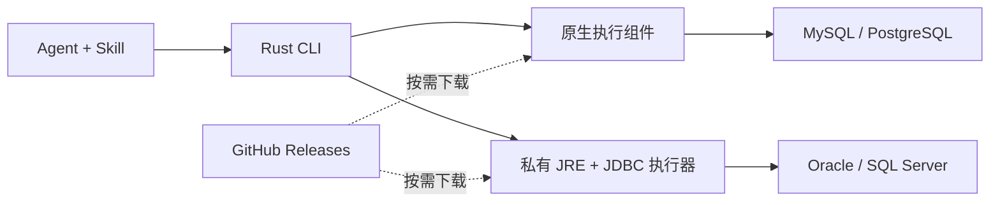

# SQL CLI 首版设计方案

更新日期：2026-09-10
状态：首版实现中；下文为设计目标，实际支持及验证状态见 README。

## 1. 目标

设计一个独立的新 CLI，业务核心是用户级数据源管理、数据库连接与 SQL 执行。配套 Skill 说明 CLI 的使用方法，并提供各数据库的常见操作文档，供 Agent 选择 SQL 后直接通过 CLI 执行。

初始化、凭据加密和驱动下载是支撑上述能力的基础模块。首版以最小、完整的实现为目标。

设备标识需要关联同一台机器，为后续自动更新、设备信息上报和日活统计提供基础；首版先确定标识模型，联网更新及活跃上报后续实现。

本文将已经明确的产品范围与建议的实现方式分开记录。文中的 `sqlx` 用作命令示例名，用户目录采用讨论中的 `~/.sqlx/`。按最新讨论，原生数据库连接与 Rust/JDBC 桥接优先复用 Chat2DB-Rust 中的实现，按本 CLI 的执行与交付边界适配。

## 2. 首版范围与当前分发建议

除下载来源根据最新讨论调整为下述建议外，其余产品范围沿用已确认的决定。

| 项目 | 决定或建议 |
|---|---|
| 主程序 | 使用 Rust，按平台交付独立可执行文件 |
| 驱动路线 | Rust 原生驱动 + JDBC 补充 |
| 驱动安装 | 不随主程序安装，首次使用时按需下载到用户数据目录 |
| 原生组件形态 | 数据库驱动库与连接、SQL 执行代码编译成独立可执行组件，由主 CLI 下载并调用 |
| 代码来源 | 原生连接与 Rust/JDBC 桥接优先参考、提取 Chat2DB-Rust 的相关实现 |
| JDBC 依赖 | JRE、JDBC 执行器、驱动 JAR 及必要依赖均按需下载 |
| 下载来源 | 建议首版使用公开 GitHub Releases，驱动版本、默认选择和升级目标仍由产品方维护 |
| 首版数据库 | MySQL、Oracle、SQL Server、PostgreSQL |
| 数据源范围 | 用户级存储，账号和密码加密保存 |
| 初始化 | 本地生成独立加解密密钥、关联机器的设备标识，以及安装实例标识 |
| 设备标识用途 | 为后续自动更新、设备信息上报和日活设备统计提供关联键 |
| SQL 输入 | 支持一次执行多条 SQL；首版不支持文件输入 |
| SQL 选项 | 事务模式和失败策略的选择参数留待后续扩展 |
| 会话 | 首版不支持跨调用会话 |
| 输出 | 完整的结构化结果，CLI 不主动截断 |
| 大结果优化 | 后续可返回部分结果，并将全量结果写入文件 |
| 配套 Skill | CLI 用法，以及查看 database、schema、DDL 等数据库操作配方 |
| Skill 分发 | 建议作为独立文档包发布到 GitHub Releases，按需下载，并安装到所选 Agent 的技能目录 |
| 安装入口 | 支持 CLI 直接安装 Skill，也支持先安装 Skill，再由 Skill 指导 Agent 安装 CLI |
| 当前交付 | 仅产出设计文档 |

### 2.1 首版功能与命令速览

下表是首版计划支持的能力和建议命令契约，尚未实现。命令以 `sqlx` 为例，`<id>` 表示稳定的数据源 ID，`...` 表示按数据库类型提供的连接参数；账号密码的具体输入形式仍按第 5 节定稿。

| 功能 | 首版支持内容 | 命令或触发方式 |
|---|---|---|
| 初始化 | 创建用户目录、独立加密密钥、设备 ID、安装实例 ID；重复初始化保留有效状态 | `sqlx init`；首次需要本地状态时也可自动初始化 |
| 添加数据源 | 保存 MySQL、MariaDB、PostgreSQL、CockroachDB、Oracle、SQL Server、ClickHouse、Trino 的连接配置 | `sqlx datasource add ...` |
| 列出数据源 | 返回当前用户的数据源列表，隐藏敏感信息 | `sqlx datasource list` |
| 查看数据源 | 查看一个数据源的非敏感配置 | `sqlx datasource show --id <id>` |
| 修改数据源 | 修改连接配置或凭据，保持数据源 ID 不变 | `sqlx datasource update --id <id> ...` |
| 删除数据源 | 删除当前用户保存的指定连接配置，不删除数据库内容 | `sqlx datasource remove --id <id>` |
| 测试连接 | 建立临时连接，返回结构化检测结果后关闭 | `sqlx datasource test --id <id>` |
| 执行单条 SQL | 查询、DML、DDL 等驱动可执行 SQL | `sqlx sql execute --datasource <id> --sql "SQL"` |
| 执行多条 SQL | 同一连接按序执行，默认自动提交、遇错停止，逐条返回结果 | `sqlx sql execute --datasource <id> --sql "SQL 1" --sql "SQL 2"` |
| 查看数据库结构 | 根据 Skill 配方查询 database、schema、表、列、索引、约束和 DDL | 统一使用 `sqlx sql execute`，不增加专用元数据命令 |
| 完整结构化输出 | 返回全部查询数据、列类型、更新计数和执行错误，不主动截断 | SQL 执行命令默认输出结构化 JSON，无需额外开关 |
| 凭据加密 | 账号密码随用户级数据源配置加密保存，读取时隐藏 | 数据源命令自动处理，无需单独加解密命令 |
| 驱动及运行时准备 | 按清单下载原生执行组件，或 JDBC 执行器、驱动及私有 JRE；复用本地缓存 | 连接测试、SQL 执行时自动触发，无需手动安装 Java 或选择驱动版本 |
| 安装 Skill 到 Agent | 下载兼容版本的 Skill 和数据库文档，安装到选定 Agent 的技能目录 | `sqlx skill install --target <Agent名称>` |
| 安装 Skill 到指定目录 | 下载并安装完整 Skill 包，保留引用文档目录 | `sqlx skill install --path <目标技能目录>` |
| 更新 Skill | 更新由 CLI 管理的 Skill 至兼容版本 | `sqlx skill update` |
| 查看 Skill 状态 | 查看安装版本和安装目标 | `sqlx skill status` |
| Skill 引导安装 CLI | Agent 检查 CLI，缺失时按 Skill 下载、校验、安装并初始化 | Skill 中的 `references/install-cli.md`；安装前不依赖任何 `sqlx` 命令 |
| 帮助 | 查看命令和参数说明 | `sqlx --help`、`sqlx <子命令> --help` |
| 版本 | 查看主程序版本，供用户与 Skill 判断兼容性 | `sqlx --version` |

数据源和 SQL 的业务响应采用结构化输出；帮助说明保留可读文本。驱动与运行时的具体版本由发布清单控制，首版不新增要求用户自行管理版本的驱动命令。

首版不包含 SQL 文件输入、跨调用会话、事务模式及失败策略的选择参数、结果分页或全量写文件、主程序自动更新，以及设备信息上报和日活统计服务。设备标识先在本地生成，相关联网功能后续实现；Skill 的显式安装与更新属于首版。

### 2.2 首批平台

| 操作系统 | CPU 架构 |
|---|---|
| macOS | ARM64、x64 |
| Windows | x64 |
| Linux | ARM64、x64 |

原生组件和 JRE 按操作系统、CPU 架构分别发布。纯 Java JDBC 驱动通常可以复用同一份 JAR；包含本地库的驱动仍需验证平台兼容性。最低操作系统版本和 Linux 运行库基线在发布阶段确定。

## 3. 执行架构

### 3.1 首版驱动分工建议

| 数据库 | 建议后端 | 说明 |
|---|---|---|
| MySQL | Rust 原生执行组件 | 优先提取 Chat2DB-Rust 的 `mysql_async` 连接和执行逻辑，随组件构建发布 |
| PostgreSQL | Rust 原生执行组件 | 优先提取 Chat2DB-Rust 的 `tokio-postgres` 连接和执行逻辑，随组件构建发布 |
| Oracle | 官方 JDBC Thin 驱动 | 通过私有 Java 运行时执行，无需另外安装 Oracle 客户端 |
| SQL Server | 官方 Microsoft JDBC 驱动 | 复用官方驱动和通用 JDBC 执行器 |

后两项先按账号密码连接设计；集成认证等连接方式是否引入额外本地依赖，需要单独验证，不能直接继承纯 Java 连接方式的交付结论。



### 3.2 主程序与执行组件的职责

Rust 主程序负责命令解析、初始化、加密数据源存储、组件准备和统一结果输出。数据库执行组件负责建立连接、执行 SQL、读取结果和关闭连接。

原生驱动确定做成独立可执行组件，建议通过标准输入输出与主 CLI 通信。数据库驱动库与连接、SQL 执行代码由产品方预先编译到驱动组件中，再按平台分发。主程序包不包含数据库驱动，用户首次使用时下载编译好的组件，无需安装 Rust 或本地编译。

JDBC 路线使用通用 Java 执行器，按数据源选择驱动 JAR 和兼容的私有 JRE。Java 运行时由 CLI 管理，用户不需要手动安装 Java。只使用原生数据库的用户不下载 Java。

两条路线遵守同一版本化执行协议，对 Agent 暴露相同的 CLI 入口和结果结构。一次调用启动相应执行组件，在一条连接上完成本次工作后退出；首版不引入常驻会话服务。

数据源明确绑定执行后端。一次执行失败后，不静默切换另一种驱动并重放 SQL。

### 3.3 Chat2DB-Rust 代码复用范围

本节依据 2026-09-10 拉取后检查的 `Chat2DB-Rust/main`，源码基线为 `e17ee8be373407e193e7e12da0dcd3b5b4b5550b`。本轮只做源码审阅和方案更新，尚未复制、构建或验证新 CLI。

实施策略是优先提取现成的连接、执行、类型转换和进程桥接代码，再替换为新 CLI 的配置、协议和输出结构。具体 Rust 依赖优先沿用对应实现使用的库，无需为了统一库名先改写为 SQLx。

| 复用内容 | 源码入口 | 适配方式 |
|---|---|---|
| MySQL 连接与执行 | [native_mysql.rs](https://github.com/OtterMind/Chat2DB-Rust/blob/e17ee8be373407e193e7e12da0dcd3b5b4b5550b/crates/chat2db-core/src/native_mysql.rs)：`connection_opts`、`open_connection_with_opts`、`execute_console_statement`、`mysql_value` | 提取 `mysql_async` 参数构造、连接、逐结果读取与类型转换，替换产品请求和结果类型 |
| PostgreSQL 连接与执行 | [native_postgres.rs](https://github.com/OtterMind/Chat2DB-Rust/blob/e17ee8be373407e193e7e12da0dcd3b5b4b5550b/crates/chat2db-core/src/native_postgres.rs)：`connection_config`、`open_prepared_connection`、`execute_console`、`decode_postgres_value` | 提取 `tokio-postgres` 连接、TLS、行读取和类型转换，按本次调用持有连接 |
| Rust 启动与管理 Java | [supervisor/mod.rs](https://github.com/OtterMind/Chat2DB-Rust/blob/e17ee8be373407e193e7e12da0dcd3b5b4b5550b/crates/chat2db-java-bridge/src/supervisor/mod.rs)：`EngineConfig`、`spawn_process`、`EngineSupervisor` | 复用启动、标准输入输出、握手和进程退出处理，按单次 CLI 调用简化生命周期 |
| Rust JDBC 请求与响应 | [supervisor/jdbc.rs](https://github.com/OtterMind/Chat2DB-Rust/blob/e17ee8be373407e193e7e12da0dcd3b5b4b5550b/crates/chat2db-java-bridge/src/supervisor/jdbc.rs) 与 [chat2db-engine-protocol](https://github.com/OtterMind/Chat2DB-Rust/blob/e17ee8be373407e193e7e12da0dcd3b5b4b5550b/crates/chat2db-engine-protocol/) | 提取驱动加载、连接会话、查询/更新和结果批次通信；所需协议类型随组件一起迁移 |
| Java 外部 JAR 加载 | [DriverRegistry.java](https://github.com/OtterMind/Chat2DB-Rust/blob/e17ee8be373407e193e7e12da0dcd3b5b4b5550b/java/compat-runtime/src/main/java/ai/chat2db/rust/compat/DriverRegistry.java) | 复用 JAR 校验、`URLClassLoader` 加载和 `Driver.connect`，驱动路径改用本 CLI 下载目录 |
| Java 会话与 SQL 执行 | [JdbcRuntime.java](https://github.com/OtterMind/Chat2DB-Rust/blob/e17ee8be373407e193e7e12da0dcd3b5b4b5550b/java/compat-runtime/src/main/java/ai/chat2db/rust/compat/JdbcRuntime.java) 与 [JdbcSession.java](https://github.com/OtterMind/Chat2DB-Rust/blob/e17ee8be373407e193e7e12da0dcd3b5b4b5550b/java/compat-runtime/src/main/java/ai/chat2db/rust/compat/JdbcSession.java) | 复用连接与执行基础，为新入口补齐混合查询/更新、多结果集和批次逐项输出 |

不能直接整包接入 `chat2db-core`：现有原生文件依赖 `Application`、`Storage`、产品会话、结果留存及大量元数据能力。新 CLI 提取连接与执行需要的函数、类型和对应验证用例，移除这些产品依赖后构建独立驱动组件。

复制时需要逐项适配以下已确认差异：

1. **完整输出。** 现有原生查询和 JDBC 查询包含分页、行数、累计结果字节数或单值大小限制，不能直接继承为新 CLI 的输出截断规则。保留有界的分批传输与背压，调整为持续输出全部结果；单个大字段需要完整编码或分块，不能省略内容。
2. **统一多 SQL 入口。** 现有 JDBC `executeQuery` 与 `executeUpdate` 分开，查询实现使用 `PreparedStatement.executeQuery()`；迁移时需要支持新入口的混合语句和多个结果集，不能只将 SQL 数组循环交给查询接口。
3. **连接生命周期。** 新 CLI 的一次批次只建立一条连接，批次结束后关闭。提取底层连接代码后按这一边界组织调用，不逐条调用会自行重新连接的产品入口。
4. **组件分发。** 现有库级调用拆为可按需下载的原生执行程序和 JDBC 执行器，接入 GitHub Releases 清单及用户目录。源码复用不等于独立组件的打包、升级已经完成。
5. **配置与协议映射。** 替换产品级请求、错误和数据类型；逐项核对 TLS、默认执行行为和类型编码，使其符合本 CLI 的约定。

Oracle 和 SQL Server 的 JDBC 路线使用上述通用桥接加载各自官方驱动。复用通用桥接不代表这两种数据库的新组件已完成适配，仍需按首版连接、执行和完整输出要求验证。

## 4. 用户数据目录与初始化

### 4.1 目录建议

```text
~/.sqlx/
├── identity.json
├── master.key
├── datasources.enc
├── skills/
│   └── sqlx/<版本>/
│       ├── SKILL.md
│       └── references/
├── runtimes/
│   └── java/<版本>/<平台架构>/
├── engines/
│   └── jdbc/<版本>/runner.jar
└── drivers/
    ├── mysql/<版本>/<平台架构>/
    ├── postgresql/<版本>/<平台架构>/
    ├── oracle/<版本>/
    └── sqlserver/<版本>/
```

目录归当前操作系统用户所有；Windows 中对应当前用户目录下的 `.sqlx`。同一设备上正常升级主程序和驱动不重建身份标识，不清空数据源，不替换加密主密钥。

### 4.2 初始化过程

建议提供显式 `init` 命令，并在首次需要本地状态时自动完成初始化。

1. 创建用户数据目录并设置当前用户访问权限。
2. 使用操作系统安全随机源生成独立的 256 位主密钥。
3. 获取可用的机器标识，派生 `device_id`；另生成随机 `installation_id`，将派生标识和来源信息写入身份文件。
4. 创建加密的数据源存储。

初始化需要幂等：已有文件有效时继续使用，不重新生成。已有加密数据但密钥缺失时，应明确报告无法解密，不能用新密钥覆盖原状态。并发首次启动时，初始化过程需要串行保护，避免生成两份密钥或身份标识。

### 4.3 加密存储建议

采用 AES-256-GCM 加密数据源配置，账号和密码包含在加密内容中。每次加密生成新的 nonce，存储格式包含格式版本、nonce、密文与认证标签。

主密钥首版保存在独立的本地文件中。Unix 系统目录权限建议为 `0700`、密钥和数据文件为 `0600`；Windows 设置对应的当前用户文件 ACL。读取、修改、加密保存应通过短时文件锁和原子替换完成，避免并发 CLI 调用丢失修改。

该设计防止数据源文件单独泄露后直接暴露明文凭据。如果密文和主密钥同时被获取，数据仍然可以被解密；它不是对当前操作系统用户或管理员的隔离边界。

连接时只向执行组件传递本次连接所需的解密配置，不传递主密钥；凭据不写入日志、命令行参数或普通查询响应。数据源列表和详情不回显账号、密码等敏感值。

### 4.4 设备标识与安装实例

用户已明确希望标识关联机器，用于后续自动更新、设备信息上报和日活统计。采用两个不同标识，不再用单个随机 `client_id` 同时代表机器与安装。

| 字段 | 用途 | 建议生成方式 |
|---|---|---|
| `device_id` | 关联同一台机器，作为设备活跃去重和后续更新灰度分组的键 | 根据可用的稳定机器标识派生 |
| `installation_id` | 标识当前操作系统用户目录下的一次安装，用于区分同设备多个安装实例 | 初始化时随机生成 UUIDv4 |
| 本地主密钥 | 数据源加解密 | 操作系统安全随机源生成，与两个身份标识独立 |

机器标识的候选来源如下，具体访问方式在五个平台目标上验证：

| 系统 | 优先来源 | 无法获取有效硬件标识时 |
|---|---|---|
| macOS | IOKit 的 `IOPlatformUUID` | 使用持久随机后备标识，并标记为安装级 |
| Windows | SMBIOS UUID，例如 `Win32_ComputerSystemProduct.UUID` | 可退回系统 `MachineGuid`，标记为操作系统级 |
| Linux | 可读取的 DMI product UUID | 退回 `/etc/machine-id`，标记为操作系统级 |

先排除空值、全零和已知占位值；不为了设备统计要求管理员权限。硬件与系统来源均不可用时使用持久随机后备标识，并明确 `identity_scope=installation`。`machine-id`、`MachineGuid` 属于系统身份，不能宣称等同于物理硬件身份。

原始机器标识只在本地参与派生，建议使用以下形式：

```text
device_id = HMAC-SHA-256(
    产品固定的身份派生常量 v1,
    平台 + 标识来源 + 规范化后的原始机器标识
)
```

该常量在产品安装实例之间保持一致，不随普通版本升级变化，也不是保密凭据。它用于隔离不同产品的标识空间，不能使用每次初始化随机生成的加密主密钥替代，否则重新安装后同一台机器会得到不同设备 ID。

`identity.json` 保存 `device_id`、`installation_id`、`identity_version`、`identity_source` 和 `identity_scope`。原始硬件 UUID、系统 machine-id 不随活跃信息上报。派生标识仍具有设备关联性，不能把哈希处理称为完全匿名化。

标识生命周期按以下规则设计：

- 使用可重新读取且值未变化的硬件或系统来源时，正常升级或删除用户目录后重新初始化，派生的 `device_id` 相同；删除目录后生成新的 `installation_id` 和主密钥。
- 使用随机后备来源时，只能保证保留用户目录期间标识稳定；删除目录后生成新的设备 ID，不能恢复机器关联。
- 同一机器的多个用户安装，在获得同一机器来源时共享 `device_id`，各有自己的安装实例和加密存储；标识来源不同则不能保证归并。
- 选定来源后保持稳定，启动时重新检查该来源；机器标识变化时更新设备身份和安装实例标识，本地主密钥保持独立，不因硬件变化破坏数据解密。
- 复制用户目录到另一台机器后，应根据目标机器重新派生设备 ID，不能永久沿用文件里的旧 ID。来源暂时不可读取时保留缓存并延后核对，不每次生成新 ID。
- 硬件更换、系统重装或来源变化可能产生新 ID；使用硬件来源时重装系统通常更稳定，使用系统来源时不作此保证。虚拟机克隆也可能复制底层 UUID，首版不承诺不可伪造的物理机器绑定。

设备 ID 用于统计和设备关联，不是认证凭据。本地密钥继续独立随机生成，不从硬件信息或设备 ID 派生。

### 4.5 后续自动更新与日活上报

首版准备好上述标识。自动更新检查、信息上报和服务端统计作为后续功能，不因本节增加首版常驻后台进程。

文件仍通过 GitHub Releases 分发。设备活跃统计另需一个轻量服务端接口；GitHub 资产下载次数不能代表设备日活。更新元数据和活跃信息可以通过同一次请求交换，但服务端要区分实际使用产生的活跃与纯后台版本检查。

建议活跃请求只包含 `device_id`、`installation_id`、身份来源级别、CLI 版本、操作系统和 CPU 架构等必要运行信息。数据库账号密码、连接地址、数据源名称、SQL、查询结果和原始硬件标识不进入该请求。功能上线时说明采集项和用途。

日活统计口径：

1. 用户或 Agent 执行有效的数据源或 SQL 业务命令，才产生设备活跃；仅查看帮助、输出版本或后台检查更新不算活跃。
2. 服务端按固定统计时区的日期与 `device_id` 去重，建议采用 `Asia/Shanghai`，由服务端接收时间确定日期。
3. 同一设备一天执行多条 SQL、启动多个 CLI 进程、触发多个 Agent 调用，计为一个日活设备。同设备多个安装实例上报相同设备 ID 时同样去重。
4. 客户端可做本地短时节流，服务端负责权威去重；上报和更新检查使用短超时，失败不阻断数据库操作，也不自动重放 SQL。
5. 无法联网的使用不会立即计入服务端日活；离线补报属于后续统计能力，不用下载次数估算缺失活跃。

这个指标应命名为“日活设备数”。同一人使用多台机器会计多份，多人共用同一设备 ID 会合并；同一物理机器的不同操作系统也可能派生不同 ID，首版不做跨系统归并。如后续需要真实用户日活，再通过独立账号 `user_id` 关联设备。

自动更新可利用设备 ID 做稳定灰度分组，并结合平台、架构、当前版本决定目标版本。更新资源仍从发布清单中的固定 URL 下载并校验，设备 ID 不参与数据源解密。

## 5. 数据源与连接管理

首版提供创建、列表、查看、修改、删除和连接测试。

每个数据源具有稳定 ID，保存名称、数据库类型、后端标识、连接参数和加密凭据。修改名称不改变数据源 ID。

连接参数至少覆盖主机、端口、账号、密码以及数据库专属目标：MySQL、MariaDB、PostgreSQL、CockroachDB、ClickHouse 的 database、Oracle 的 service name 或 SID、SQL Server 的 database、Trino 的 catalog（可带 schema）。MariaDB 与 CockroachDB 分别复用 MySQL 与 PostgreSQL 的 native worker。TLS 等必要连接参数按实际驱动契约提供，不假定四种数据库具有完全相同的参数集。

连接测试建立临时连接，完成握手和必要的轻量验证后关闭；返回结构化成功或失败信息，不建立跨调用连接。

命令形态示意：

```text
sqlx init
sqlx datasource add ...
sqlx datasource list
sqlx datasource show --id <数据源ID>
sqlx datasource update --id <数据源ID> ...
sqlx datasource remove --id <数据源ID>
sqlx datasource test --id <数据源ID>
```

以上为命令设计建议，尚未实现。账号密码的交互输入与 Agent 非交互输入形式在接口定稿时补齐，避免把真实凭据放入进程命令行。

## 6. SQL 执行

### 6.1 多语句输入

建议通过可重复的 `--sql` 参数提交多条 SQL，每个参数表示一条完整的驱动可执行语句。

```bash
sqlx sql execute --datasource dev \
  --sql "SELECT 1" \
  --sql "SELECT 2"
```

内部请求使用语句数组，并保留输入顺序。首版不接收 SQL 文件、批次文件或 `--file` 参数；不提供完整数据库客户端脚本解释器。

不按分号切分字符串，避免破坏字符串字面量和过程体。`DELIMITER`、`GO`、psql 反斜杠命令等属于客户端脚本指令，不应作为普通 SQL 发给驱动。

### 6.2 首版默认执行语义建议

事务模式和失败行为的选择参数后续扩展，但首版需要固定且公开默认行为。

| 项目 | 建议默认行为 |
|---|---|
| 连接 | 本次调用使用同一条连接 |
| 顺序 | 按输入顺序逐条执行 |
| 初始提交模式 | 自动提交；SQL 自身及数据库特有的事务语义仍然生效 |
| 失败行为 | 首次失败后停止后续语句，保留已确认结果 |
| 批次原子性 | 不隐式包裹事务，不承诺整个批次全部回滚 |
| 未确认的执行或提交 | 返回结果未知，不自动重试当前语句或整个批次 |
| 调用结束 | 关闭连接；不得额外自动提交遗留事务，清理由数据库和驱动语义决定 |

临时表、会话变量和连接状态可在本次调用中延续，不能延续到下一次 CLI 调用。PostgreSQL 切换 database 需要建立另一条连接，不能通过通用 `USE` 语句完成。

一条 SQL 可能产生多个结果集或更新计数；执行器需要读取完整结果后再执行下一条。JDBC 应使用适用于混合查询和更新的执行路径，不能把 `executeBatch()` 等同于任意多 SQL 的通用入口。

执行成功与事务已提交分别表达。MySQL 的部分 DDL 会隐式提交，不能仅凭同一连接或未来的事务选项承诺批次原子性。

## 7. 结构化输出

首版建议输出单份完整的结构化 JSON，不设置隐式行数上限，不主动截断或省略大字段。用户 SQL 中显式指定的限制仍然生效。全量数据写入文件属于后续扩展。

结果包含请求完成情况、数据源 ID、逐语句状态和结果。每条语句至少区分：成功、失败、结果未知、未执行；事务提交状态不能由语句成功状态直接推断。

每条语句的结果支持多个行集或更新计数。行集采用列数组和按位置排列的行数组，避免重复列名覆盖数据：

```json
{
  "columns": [
    { "name": "id", "database_type": "BIGINT", "encoding": "string" },
    { "name": "amount", "database_type": "DECIMAL", "encoding": "string" }
  ],
  "rows": [
    ["9007199254740993", "123.4500"]
  ]
}
```

该示例只说明一个行集的表示方式，最终字段名在执行协议定稿时确定。

- 大整数、精确小数通过字符串和类型信息保留精度。
- 二进制使用 Base64，并标明编码。
- 时间类型保留原有精度及有无时区的语义，不能擅自补时区。
- `NULL` 与空字符串、空二进制分开表达。
- 无法无损表示的类型明确报告，不静默转成错误的数值或空值。

错误结果包含数据库错误码、错误消息、语句位置和后续未执行项。存在失败、结果未知或输出中断时不能以成功退出。

为避免 CLI 自身累积整个结果，逐步读取和序列化到标准输出；各驱动内部的游标、抓取批次及缓存行为仍需验证。标准输出只承载结构化结果，运行日志和下载进度写入标准错误。

完整成功需要完整响应和成功退出。进程终止造成的 JSON 不完整、管道关闭等情况不代表数据库写入失败，Skill 应明确不能据此自动重放。

CLI 不截断结果，不等于 Agent 宿主没有输出长度限制；宿主仍可能截断其显示或上下文。后续再通过结果文件机制改善这一体验。

## 8. GitHub Releases 下载与升级

### 8.1 分发位置

建议首版直接使用公开 GitHub Releases 承载主程序、执行组件和 Skill 文档包，无需先搭建自有 CDN。二进制包作为 Release 附件上传，不提交到 Git 源码历史中，也不把有保留期限的 CI 临时构建产物当作正式下载源。Skill 的 Markdown 源文件可在 GitHub 仓库中维护，发布时打包为固定版本附件。

可在产品公开仓库的 Releases 中发布，具体仓库名称在发布阶段确定。公开 Release 附件允许用户匿名下载；本方案不依赖用户提供 GitHub Token。

| 资源 | 建议分发方式 |
|---|---|
| Rust 主程序 | 自有 GitHub Releases，按平台与架构发布 |
| MySQL / PostgreSQL 原生执行组件 | 自有 GitHub Releases，按平台与架构发布 |
| JDBC 执行器 | 自有 GitHub Releases，发布版本化 JAR |
| Oracle / SQL Server JDBC 驱动 | 确认选定版本的再分发条款后，连同许可证作为 Release 附件发布；也可在清单中指定厂商官方固定地址 |
| 私有 JRE | 可直接使用所选发行商的官方固定版本资产；如需在自有 Release 镜像，同样遵循该运行时的再分发要求 |
| 配套 Skill 与数据库操作文档 | 自有 GitHub Releases，发布一份跨平台通用 ZIP 文档包 |
| 组件清单 | 作为版本化 Release 附件发布，列出所有组件及其兼容关系 |

SQL Server 官方文档说明 JDBC 6.0 及以上版本允许再分发，但应遵守所选版本许可证。Oracle JDBC FAQ 指向 FUTC；该条款允许在约定条件下再分发未修改的程序，包括附带许可证、保留权利声明且不向最终用户额外收取驱动使用费。实际上传以选定驱动版本随附的条款为准。

### 8.2 组件清单与下载过程

产品方维护组件清单、默认版本和升级目标，用户不需要手动选择驱动坐标或 Java 版本。更换文件托管位置不改变驱动管理职责。

清单至少声明：组件 ID、版本、平台架构、下载 URL、校验值、执行协议版本、最低兼容 CLI 版本，以及 JDBC 执行器所需 Java 版本和驱动依赖。Skill 文档包声明跨平台属性和兼容 CLI 版本范围，不要求可执行组件的协议字段。

二进制 URL 使用固定 Release tag 和资产名，并校验 SHA-256；不要对每个组件分别请求 `latest`，避免下载到不兼容的组合。形式示意如下，实际仓库、tag 和资产名尚未创建：

```text
https://github.com/<组织>/<仓库>/releases/download/<tag>/<asset-name>
```

首版可以由 CLI 和 Skill 安装文档分别携带已知清单地址，清单通过普通 HTTPS 即可读取，不依赖已安装 CLI。后续检查升级时先解析并缓存完整兼容清单，再按清单中的固定 URL 下载；不必在每次连接前调用 GitHub API。普通连接优先复用已安装且校验完整的组件。

首次连接流程：

1. 根据数据源类型确定后端和产品方指定的兼容组件版本。
2. 检查本地组件是否完整可用。
3. 缺失时从清单指定的 GitHub Release 或官方固定地址下载到临时位置，校验后安装到版本目录。
4. JDBC 路线按需补齐私有 JRE、执行器和对应 JAR。
5. 启动执行组件并建立连接。

兼容的 JDBC 数据库共享 JRE 和执行器。原生组件、JDBC 执行器、驱动 JAR、JRE 和 Skill 文档包允许分别发布，由兼容清单决定可使用的组合。Skill 的安装和更新复用清单下载与校验流程，无需为此连接数据库或下载数据库驱动。

相同组件的并发下载需要互斥，完成校验后原子切换可用目录；下载失败不留下被误认为已安装的组件。升级采用版本目录并存，不覆盖正在使用的文件，也不在一个 SQL 批次中间切换版本。

版本清单的刷新时机与升级触发时机在发布实现时确定，版本和兼容组合仍由产品方控制。

### 8.3 交付边界

GitHub 当前文档允许每个 Release 最多包含 1000 个资产，每个文件小于 2 GiB；未设置 Release 总大小及带宽用量上限。首版是否符合单文件限制，以实际构建产物检查为准。

GitHub 在部分国内网络中的下载速度和可达性可能不稳定，因此首版不承诺所有网络环境均可直接下载。组件清单使用普通下载 URL，后续可以增加 CDN 或镜像地址，同时复用相同版本、校验值及本地缓存机制。

## 9. 配套 Skill

Skill 入口及全部参考文档统一使用英文；每个 SQL 操作分别说明用途、参数、返回结果和官方文档链接。

### 9.1 内容组织

`SKILL.md` is an index, not a manual. It only states how to confirm the CLI, gives the shortest command example, routes the agent to one reference file per task, and lists the rules that always apply: read the approval contract before a state-changing statement, let the user type credentials in the local page, return the page URL to the user, keep TLS verification on, and explain that a first command can wait for a download. The file is capped at 45 lines; `tests/distribution.py` asserts that cap, asserts that the index links every file under `references/`, and asserts that the approval and download contracts still live in their own files.

```text
SKILL.md                       # index: routing table plus the always-applied rules
references/
├── install-cli.md             # installing or repairing the CLI, PATH, managing this Skill
├── updates.md                 # checking, installing and troubleshooting CLI updates
├── connections.md             # init, list/create/edit/test a datasource, TLS, engine-specific fields
├── local-ui.md                # browser password entry, result pages, refresh, UI plugins and lifecycle
├── approval.md                # the mandatory approval contract before state-changing SQL
├── execution.md               # execution semantics, output fields, partial and unknown outcomes, retries
├── downloads.md               # first-use downloads, progress and retries, prefetch components
└── <database>.md              # one SQL recipe per supported engine
```

The agent reads the index first, then loads only the reference the current task and connected datasource need. Each database keeps its own recipe instead of sharing a generic document. The approval contract and the execution semantics live in their own files, but the index requires reading the approval file before any state-changing statement, so neither can be skipped.

数据库配方覆盖查看 database、schema、表、列、索引、约束和 DDL，以及标识符引用、常见错误和适用版本。各库对 database、schema、service 等概念的差异应直接说明。 每个操作独立说明用途、需替换参数、SQL、返回字段和限制，并在操作旁附对应的官方文档链接。Agent 有联网工具时可按实际服务器版本查阅官方说明；没有联网能力时使用包内配方，不声称已经在线核实。

DDL 文档需要标明返回范围。例如 MySQL 可用 `SHOW CREATE TABLE`；PostgreSQL 没有通用 `SHOW CREATE TABLE`，只查询列信息不能称为完整 DDL。完整结构还可能涉及约束、索引、序列、分区和依赖。

首版元数据操作通过 SQL 配方完成，不为每一种数据库操作扩展单独的 CLI 子命令。配方应使用 SQL 输入，不依赖首版尚未支持的文件输入或客户端脚本指令。

### 9.2 通过 CLI 下载与安装 Skill

Skill 与数据库操作文档作为独立 ZIP 包上传到 GitHub Releases，例如 `sqlx-skill-<版本>.zip`。包内仅包含 `SKILL.md` 和相对路径引用的文档，同一份资源可用于全部首批平台，不需要分别编译。

建议提供以下命令形态，具体参数在实现时定稿：

```text
sqlx skill install --target <Agent名称>
sqlx skill install --path <目标技能目录>
sqlx skill update
sqlx skill status
```

安装过程：

1. 从产品清单选择兼容当前 CLI 的 Skill 版本及固定 GitHub Release 下载地址。
2. 下载、校验 SHA-256，并完整解压到 `~/.sqlx/skills/sqlx/<版本>/`。
3. 根据显式选择的 Agent 或目录，将完整 Skill 包安装到该 Agent 支持的技能目录，保留 `references/` 的相对结构。
4. 记录安装版本及由 CLI 管理的目标目录，后续更新和状态查询复用该记录。

`~/.sqlx/skills/` 是 CLI 的本地资源缓存，并不代表所有 Agent 都会自动扫描它。不同 Agent 的发现路径、目录格式和重新加载方式需要按目标适配；无需用户为下载公开 Release 附件配置 GitHub Token。

Skill 可以独立修正文档和 SQL 配方，无需重新编译主 CLI。更新只选择当前 CLI 兼容的版本，并同步到该 CLI 管理的 Skill 安装目录；存在用户修改或不归本 CLI 管理的同名目录时报告冲突，保留现有文件，不直接覆盖。

Skill 安装及更新属于资源管理入口；主程序的自动更新、后台检查和设备活跃上报仍按后续功能安排。本轮只记录分发方案，不实际发布 Skill 或修改任何 Agent 的技能目录。

### 9.3 通过 Skill 指导安装 CLI

用户可以先从 GitHub 获取 Skill 包，通过 Agent 支持的安装方式或手动放入其技能目录。Skill 的获取、发现和阅读不要求 CLI 预先存在。

`references/install-cli.md` 提供完整的引导步骤，Agent 按当前操作系统和架构执行：

1. 检查 `sqlx` 命令是否可用，读取版本并核对 Skill 声明的兼容范围；已安装且兼容时直接使用。
2. 识别 macOS、Windows 或 Linux 及 ARM64/x64，按首批支持矩阵选择主程序包；识别的是可实际运行该程序的系统环境，不能只按硬件 CPU 名称猜测。
3. 通过文档中的产品发布清单地址确定兼容 CLI 版本、固定 GitHub Release 下载 URL 和 SHA-256。
4. 使用系统下载、校验和解压工具获取主程序，不依赖 `sqlx`、Rust、Node.js 或 Java；文档分别提供 Unix Shell 与 Windows PowerShell 步骤。
5. 安装到用户级可执行目录，配置或说明如何加入 `PATH`，验证实际调用到的可执行文件路径和版本；不覆盖其他来源的同名程序。
6. 调用 `sqlx init` 初始化本地密钥与身份信息，然后继续用户的数据源或 SQL 任务；数据库驱动仍在首次连接时按需下载。

Skill 自身是安装说明，实际下载和安装由 Agent 的工具或用户执行。遇到已有但不兼容的 CLI 时，文档说明兼容版本和用户级安装位置；这是任务所需的显式安装引导，不等同于后续的后台自动更新。

两种入口形成完整流程：

| 用户最先获得的组件 | 后续流程 |
|---|---|
| CLI | 下载主程序 → 执行 `sqlx skill install` 并指定 Agent 或路径 → Agent 发现 Skill → 通过 CLI 使用数据库 |
| Skill | 下载并安装 Skill → Agent 检查 CLI → 按 Skill 指导安装并初始化 CLI → 通过 CLI 使用数据库 |

两条路径复用同一发布清单和版本兼容规则。先获得 Skill 的路径不能要求先运行 `sqlx skill install`，否则会形成安装依赖循环。安装文档与数据库配方放在同一 Skill 包中，确保 Agent 拿到 Skill 后能够完成从未安装 CLI 到执行任务的流程。

## 10. 实现模块与后续验证

业务核心保持数据源管理与 SQL 执行，建议分为以下五个模块：

| 模块 | 职责 |
|---|---|
| 初始化与本地存储 | 设备标识、安装实例、独立密钥、加密配置和并发写入保护 |
| 数据源管理 | 增删改查、参数校验、连接测试 |
| 组件管理 | 发布清单、GitHub Release / 官方资产下载、校验、兼容版本选择，以及 Skill 包安装与更新 |
| SQL 执行 | 后端调用、同连接顺序执行、失败和生命周期处理 |
| 结果编码 | 数据类型转换、完整结构化输出 |

进入实现阶段后，至少验证四库的连接、多语句同连接、中途失败、DDL/DML/查询混合执行、适用场景的多结果集、动态类型精度，以及首次下载和升级。另需验证重复初始化、密钥缺失、配置并发修改和大结果输出中断。

设备标识需验证正常升级、删除目录后重新初始化、多用户、目录迁移、无权限读取硬件标识及虚拟机环境，分别确认身份范围和密钥独立性。活跃上报实现后再验证按日去重、纯更新检查不计活跃，以及网络失败不影响业务命令。

安装流程需在支持的平台验证 CLI 安装 Skill、Skill 指导安装 CLI 两条路径，并覆盖未安装、已安装兼容版本、不兼容版本、`PATH` 未生效和同名命令冲突。验证先安装 Skill 的路径不依赖预先存在的 CLI。

这些均为后续验证计划，本文没有宣称相关能力已经实现或测试通过。

## 11. 后续扩展与实施参数

已明确后置的功能：

- 事务模式和失败策略的入口参数。
- 跨调用会话。
- SQL 文件输入和完整脚本处理。
- 返回部分结果，同时将全量结果写入文件。
- 自动更新检查、设备信息与活跃上报、日活设备统计；首版先生成所需设备与安装标识。

实施前需要补齐的参数：

- 四种数据库的最低支持版本与首版认证方式范围。
- Rust 依赖、JDBC 驱动和私有 JRE 的具体版本。
- 主程序与执行组件的协议字段、命令参数和凭据输入方式。
- 各平台最低系统版本、发布产物格式。
- GitHub 发布仓库、第三方组件来源与再分发方式、组件清单格式、清单刷新和升级触发方式。
- 首批支持的 Agent、Skill 发现路径、安装命令参数及文档包的 CLI 版本兼容范围。
- 各平台设备标识的访问方式与降级来源；活跃接口地址和服务端统计实现随后续功能定稿。

这些参数在实现与发布设计中定稿，无需为了确定参数扩大首版产品范围。

## 12. 选型依据

- [mysql_async](https://docs.rs/mysql_async/latest/mysql_async/) 与 [tokio-postgres](https://docs.rs/tokio-postgres/latest/tokio_postgres/)：当前选定复用来源采用的原生数据库库；迁移时验证具体依赖版本与支持范围。
- [Rust Reference：外部接口和 ABI](https://doc.rust-lang.org/reference/items/external-blocks.html)：Rust 默认 ABI 不提供跨版本稳定性保证，因此建议使用进程协议交付独立组件。
- [Oracle JDBC 驱动说明](https://docs.oracle.com/en/database/oracle/oracle-database/23/jjdbc/introducing-JDBC.html)：Thin 驱动为纯 Java Type IV 驱动，无需额外 Oracle 客户端软件。
- [Microsoft JDBC Driver 概述](https://learn.microsoft.com/en-us/sql/connect/jdbc/overview-of-the-jdbc-driver)：SQL Server 官方 Type 4 JDBC 驱动。
- [JDBC Statement 接口](https://docs.oracle.com/en/java/javase/21/docs/api/java.sql/java/sql/Statement.html)：执行语句、读取多个结果和更新计数的接口依据。
- [RFC 9562：UUID](https://www.rfc-editor.org/rfc/rfc9562.html)：随机安装实例 ID 和后备标识的规范依据。
- [Apple IOKit 平台标识定义](https://github.com/apple-oss-distributions/xnu/blob/main/iokit/IOKit/IOKitKeys.h)：`IOPlatformUUID` 标识来源。
- [Windows Win32_ComputerSystemProduct](https://learn.microsoft.com/en-us/windows/win32/cimwin32prov/win32-computersystemproduct)：SMBIOS UUID 来源，以及不可用时可能返回全零值。
- [systemd machine-id 文档](https://github.com/systemd/systemd/blob/main/man/machine-id.xml)：系统安装标识的生命周期，以及使用产品专属带密钥哈希派生标识的建议。
- [RustCrypto AES-GCM](https://docs.rs/aes-gcm/latest/aes_gcm/)：认证加密及 nonce 唯一性要求。
- [GitHub Releases 概述](https://docs.github.com/en/repositories/releasing-projects-on-github/about-releases)：Release 附件及存储、带宽限制。
- [GitHub Release 下载链接](https://docs.github.com/en/repositories/releasing-projects-on-github/linking-to-releases)：Release 与资产下载地址规则。
- [Oracle JDBC FAQ](https://www.oracle.com/database/technologies/faq-jdbc.html) 与 [Oracle FUTC](https://www.oracle.com/downloads/licenses/oracle-free-license.html)：第三方再分发的相关条款；实际采用版本仍需核对其随附许可。
